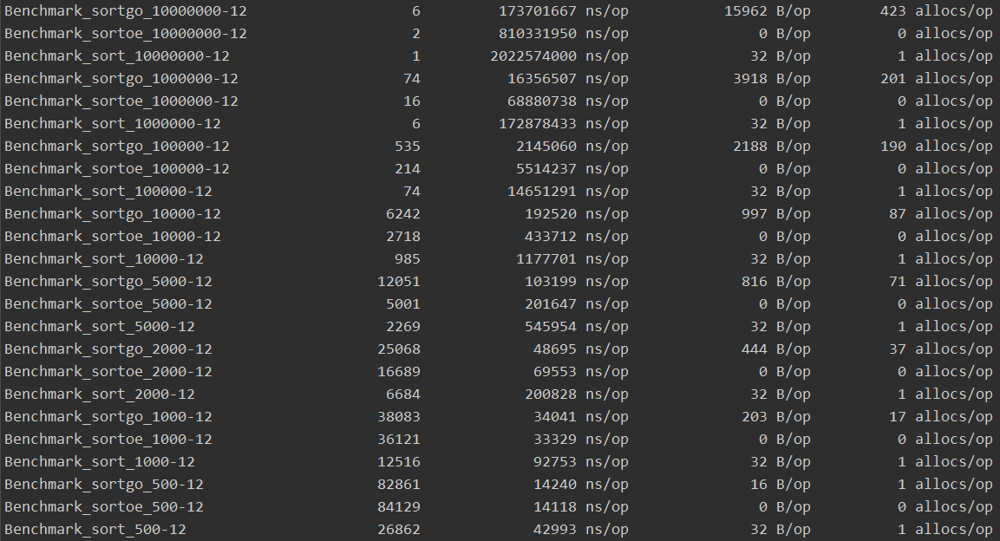

# sortoe 快速排序

## 优点

    1. 没有使用接口及反射，排序速度较官方sort包快
    2. 可选择使用启用 goroutine 并发快速排序，速度进一步提升

## 缺点

    只支持三种确定的类型，即 []int，[]float64，[]string

## Benchmark

    sortgo为调用 sortoe.IntsAscGo()
    sortoe为调用 sortoe.IntsAsc()
    sort为调用 sort.Sort()

Download and install

    go get github.com/cds325/sortoe
    
Import

    import "github.com/cds325/sortoe"
    
简单到不需要使用说明^_^

